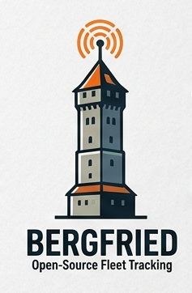
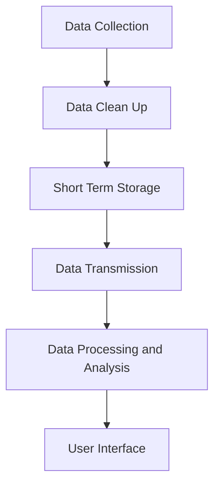
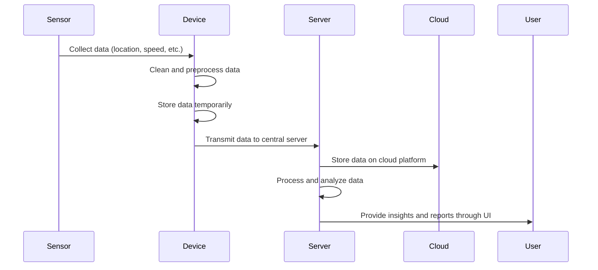

  

# Bergfried
Open-source fleet monitoring for small-scale operations.

## Overview and Data Flow
1. **Data Collection**: Sensors and devices installed on assets collect real-time data such as location, speed, altitute, temperature, and other relevant metrics.
2. **Data Clean Up**: The collected data is cleaned and preprocessed on the device to ensure accuracy and consistency. (e.g., removing outliers, weeding redundant data)
3. **Short Term Storage**: Preprocessed data is stored temporarily on the device until it is confirmed that it is transmitted successfully to the central server.
4. **Data Transmission**: The stored data is transmitted to a central server and cloud platform (if there is one).
5. **Data Storage on Central Server and Cloud Platform**: The transmitted data is stored securely on the central server and cloud platform.
6. **Data Processing and Analysis**: The data is processed and analyzed on the server to generate insights, daily reports, warnings, and other relevant information for fleet monitoring.
7. **User Interface and reporting**: A UI is provided for users to monitor their assets in real-time, view historical data, and generate custom reports based on their needs.

## Implementation Phases
Bergfried should start with a simple local setup that mining engineers can run and recover without database administration.

Stage 1:
- Phones or devices send vehicle data to a local FastAPI server, stored in SQLite.

Stage 2:
- Add CSV/JSON export and a simple local dashboard.

Stage 3:
- Add Supabase sync for remote analysis and collaboration.

Stage 4:
- Add alerts, reports, user permissions, and a richer fleet UI.

SQLite keeps the first setup lightweight. PostgreSQL and Supabase remain the later path for cloud access, remote SQL analysis, permissions, and managed infrastructure.

## Project Structure
- `server/ingestion-api/`: central FastAPI service and future SQLite persistence.
- `device/termux-phone/`: planned Android/Termux sender setup.
- `device/alpine-device/`: planned Alpine/Linux sender setup.
- `data/`: local database files and inspection utilities.

Device options feed the same server API; they are not separate server architectures.

## Phase 1 Roadmap
- Build SQLite persistence in the ingestion API with an append-only location history table.
- Add a simple verification flow: send one sample location and inspect stored records.
- Add Termux as the first device sender option after the API payload is stable.
- Add Alpine as the second device sender option using the same endpoint and payload.
- Keep Phase 1 local: no Supabase sync, dashboard, or alerts yet.

## Features
Stage 1:
- Real-time tracking of assets
- Historical data analysis and reporting
- User-friendly interface for easy navigation
- Integration with existing systems and sensors
Stage 2:
- Customizable alerts and notifications based on user-defined thresholds
- Possible AI integration for predictive maintenance and anomaly detection

## Technology Stack
- **OSes**: Alpine Linux for devices, Debian for servers
- **Programming Languages**: Python for data processing and analysis, JavaScript for user interface development
- **Databases**: SQLite for initial local storage; PostgreSQL for later scale-out
- **Cloud Services**: Supabase for later cloud storage and backend services

## Contributing
Contributions are welcome! Please fork the repository and submit a pull request with your changes. For major changes, please open an issue first to discuss what you would like to change.

## Issue Tracking
Please use the issue tracker to report bugs, suggest features, or ask questions.
